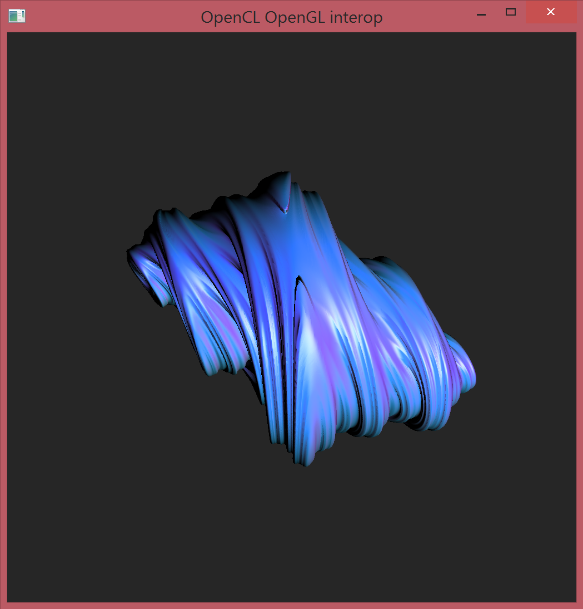

# A Quaterion Julia set implementation in Julia running on the GPU, with OpenCL and OpenGL

Code taken from:

https://developer.apple.com/library/mac/samplecode/OpenCL_RayTraced_Quaternion_Julia-Set_Example/Introduction/Intro.html

For theory and information regarding 4d quaternion julia-sets consult the following:

http://local.wasp.uwa.edu.au/~pbourke/fractals/quatjulia/

http://www.omegafield.net/library/dynamical/quaternion_julia_sets.pdf

http://www.evl.uic.edu/files/pdf/Sandin.RayTracerJuliaSetsbw.pdf

http://www.cs.caltech.edu/~keenan/project_qjulia.html

# Setup:

Currently the necessary OpenCL.jl support resides in a special branch 

````julia
Pkg.checkout("OpenCL", "vc/qjulia")
````

other requirements are:
```
- Images
- GLFW 
- ModernGL https://github.com/SimonDanisch/ModernGL.jl.git
- GLAbstraction https://github.com/SimonDanisch/GLAbstraction.jl.git
- GLWindow https://github.com/SimonDanisch/GLWindow.jl.git
```
They can be installed by executing packages.jl
# Status

It works under windows with Intel HD 4400
